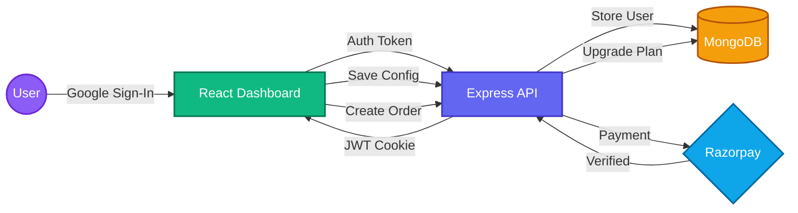
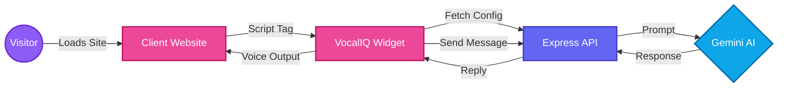

# VocalIQ 🎙️

VocalIQ is a full-stack **AI Voice Assistant Builder** — a SaaS platform that lets businesses create, configure, and embed a fully customized AI-powered voice chatbot directly into their website. Powered by **Google Gemini AI**, VocalIQ assistants understand natural language, respond with contextual intelligence, and can even navigate users through your website via voice commands.

## ✨ Features

* **No-Code Assistant Builder:** Configure your assistant's name, persona, business context, and tone through an intuitive drag-and-drop style dashboard — no coding required.
* **Google Gemini AI Integration:** Each assistant is powered by the user's own Gemini API key, enabling intelligent, context-aware responses tailored to their business.
* **Voice-Enabled Responses:** Built-in Web Speech API support enables the assistant to speak responses aloud for a true voice-first experience.
* **Smart Page Navigation:** Assistants can detect navigation intent ("Go to Pricing", "Show me Contact") and redirect end-users to the correct page of the host website using keyword-mapped routes.
* **5 Visual Themes:** Choose from `light`, `dark`, `glass`, `neon`, and `sunset` themes for the widget to match any website's design language.
* **3 Personality Tones:** Configure the assistant's communication style — `friendly`, `professional`, or `sales`.
* **One-Line Embed:** After setup, copy a single `<script>` tag and paste it before `</body>` on any website. The assistant widget appears instantly — zero dependencies.
* **Google OAuth Authentication:** Frictionless sign-up and login via Firebase Google Sign-In, tokenized with JWT via HTTP cookies.
* **Tiered Subscription Plans:** A free tier with a 200-message limit and a Pro plan (₹699 / 90 days) with unlimited messages, processed via Razorpay payment gateway.
* **Real-Time Plan & API Status Dashboard:** See remaining messages, Gemini API key status (`active`, `quota_exceeded`, `invalid`), and Pro plan expiry at a glance.
* **Dark/Light Mode:** Global theme toggle that persists across sessions.

## 🛠️ Tech Stack

**Client:**
* React 19 + Vite 8
* Tailwind CSS v4
* React Router DOM v7
* Firebase v12 (Google OAuth)
* Axios
* React Hot Toast & React Icons

**Backend:**
* Node.js + Express.js v5
* MongoDB & Mongoose v9
* JSON Web Tokens (JWT) & Cookie Parser
* Google Gemini AI SDK (`@google/genai`)
* Razorpay Node SDK (Payment Gateway)
* Nodemon (Dev)

**Embeddable Widget:**
* Vanilla JavaScript (zero-dependency `assistant.js` hosted on the Client's public folder)
* Web Speech API (voice synthesis)

## 🏗️ System Architecture & Flow

### Dashboard Flow (Business User)



### Widget Flow (Website Visitor)



## 📂 Folder Structure

```text
VocalIQ/
├── Client/                        # React + Vite Frontend
│   ├── public/
│   │   └── assistant.js           # Embeddable widget script (zero-dependency)
│   ├── src/
│   │   ├── assets/                # Static images and icons
│   │   ├── Components/
│   │   │   ├── AssistantPreview.jsx  # Live widget preview in the dashboard
│   │   │   ├── Navbar.jsx            # Top navigation bar with dark/light toggle
│   │   │   └── ProtectedRoute.jsx    # Route guard for authenticated users
│   │   ├── pages/
│   │   │   ├── Home.jsx           # Landing dashboard / overview page
│   │   │   ├── Builder.jsx        # Assistant configuration builder
│   │   │   ├── Billing.jsx        # Subscription plan & payment page
│   │   │   └── Login.jsx          # Google OAuth sign-in page
│   │   ├── utils/                 # Helper utilities
│   │   ├── App.jsx                # Root router, global state & base URLs
│   │   ├── main.jsx               # React root entry point
│   │   └── index.css              # Tailwind CSS entry point
│   ├── vite.config.js
│   ├── eslint.config.js
│   └── package.json
│
└── Server/                        # Node.js + Express Backend
    ├── Configs/
    │   ├── ConnectDB.js           # MongoDB connection setup
    │   ├── gemini.js              # Google Gemini AI client wrapper
    │   ├── razorpay.js            # Razorpay SDK initialization
    │   └── token.js               # JWT generation helper
    ├── Controllers/
    │   ├── auth.controller.js     # Google OAuth login & logout
    │   ├── user.controller.js     # Get current user, save assistant config
    │   ├── assistant.controller.js # Fetch config (public), handle AI queries
    │   └── billing.controller.js  # Create Razorpay order & verify payment
    ├── Middleware/
    │   └── isAuth.js              # JWT authentication middleware
    ├── Models/
    │   ├── user.model.js          # User schema (assistant config, plan, limits)
    │   └── billing.model.js       # Billing/order transaction schema
    ├── Routes/
    │   ├── auth.route.js
    │   ├── user.route.js
    │   ├── assistant.route.js
    │   └── billing.route.js
    ├── index.js                   # Express server entry point
    └── package.json
```

## 🚀 Installation and Setup

Follow these steps to run the project locally on your machine.

### Prerequisites
* Node.js (v18 or higher)
* MongoDB (local instance or MongoDB Atlas cluster)
* A Google account to set up Firebase
* A Razorpay account (test mode works)
* A Google Gemini API key (from [Google AI Studio](https://aistudio.google.com/app/apikey))

---

### 1. Setup the Backend

Open a terminal in the `Server` directory:

```bash
cd Server
npm install
```

Create a `.env` file in the `Server` directory and add the following variables:

```env
PORT=8000
MONGO_URI=your_mongodb_connection_string
JWT_SECRET=your_super_secret_jwt_key
RAZORPAY_KEY_ID=your_razorpay_key_id
RAZORPAY_KEY_SECRET=your_razorpay_key_secret
```

Start the backend server:

```bash
npm run dev
```

The server will start on `http://localhost:8000`.

---

### 2. Setup the Frontend

Open a new terminal in the `Client` directory:

```bash
cd Client
npm install
```

Create a `.env` file in the `Client` directory and add your Firebase configuration:

```env
VITE_FIREBASE_API_KEY=your_firebase_api_key
VITE_FIREBASE_AUTH_DOMAIN=your_project.firebaseapp.com
VITE_FIREBASE_PROJECT_ID=your_firebase_project_id
VITE_FIREBASE_APP_ID=your_firebase_app_id
```

> **Note:** Enable **Google Sign-In** in your Firebase project under **Authentication → Sign-in method**.

Start the Vite development server:

```bash
npm run dev
```

The client will start on `http://localhost:5173`.

---

### 3. Embed the Widget (Testing Locally)

Once you've configured your assistant in the Builder, copy the generated embed code snippet and paste it into any HTML file before the `</body>` tag:

```html
<body>
  <!-- Your website content -->
  <script src="http://localhost:5173/assistant.js" data-user-id="YOUR_USER_ID"></script>
</body>
```

## 🌐 API Endpoints

### Authentication Routes (`/api/auth`) — Public with Private CORS

| Method | Endpoint | Description |
|--------|----------|-------------|
| `POST` | `/google` | Sign in / register via Google OAuth (Firebase ID token → JWT cookie) |
| `GET`  | `/logout` | Clear JWT session cookie |

---

### User Routes (`/api/user`) — Protected (JWT required)

| Method | Endpoint | Description |
|--------|----------|-------------|
| `GET`  | `/current-user` | Fetch the authenticated user's full profile |
| `POST` | `/save-assistant` | Save assistant configuration (name, tone, theme, API key, pages, etc.) |

---

### Assistant Routes (`/api/assistant`) — Public CORS (used by the embeddable widget)

| Method | Endpoint | Description |
|--------|----------|-------------|
| `GET`  | `/config/:userId` | Fetch assistant configuration for a given user ID (used by the widget on load) |
| `POST` | `/ask` | Send a user message and receive a Gemini AI response; handles navigation intents |

---

### Billing Routes (`/api/billing`) — Protected (JWT required)

| Method | Endpoint | Description |
|--------|----------|-------------|
| `POST` | `/order` | Create a new Razorpay payment order for the Pro plan (₹699) |
| `POST` | `/verify` | Verify Razorpay HMAC signature and upgrade user to Pro for 90 days |

## 💳 Subscription Plans

| Feature | Free | Pro |
|---------|------|-----|
| Monthly Messages | 200 | Unlimited |
| Custom Assistant Name | ✅ | ✅ |
| Business Context | ✅ | ✅ |
| All Themes | ✅ | ✅ |
| Voice Responses | ✅ | ✅ |
| Page Navigation | ✅ | ✅ |
| Priority Support | ❌ | ✅ |
| Plan Duration | — | 90 Days |
| Price | Free | ₹699 |

## 🔮 Future Enhancements

* **Conversation History & Memory:** Store per-session chat logs so the assistant can remember context across turns.
* **Multi-Language Support:** Detect user language and respond in kind using Gemini's multilingual capabilities.
* **Custom Triggers & Actions:** Allow assistants to trigger custom JavaScript functions on the host site (e.g., open modals, fill forms).
* **Analytics Dashboard:** Visualize message volume, popular queries, navigation actions, and conversion funnels.
* **Webhook Support:** Notify external services (CRM, Slack, email) when a user interacts with the assistant.
* **White-Label Branding:** Remove VocalIQ branding from the widget for enterprise customers.
* **Team Accounts:** Multi-user access with role-based permissions for agencies managing multiple client assistants.
